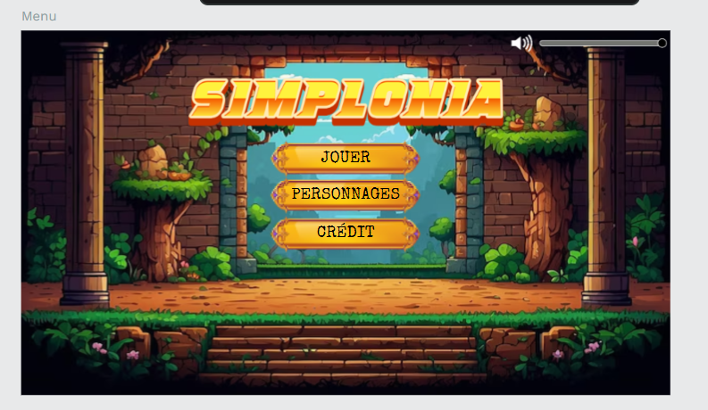
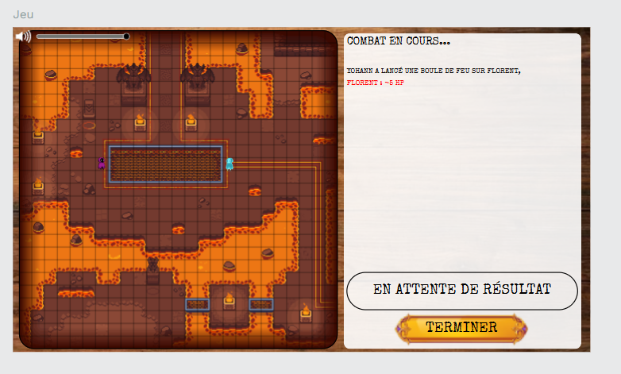
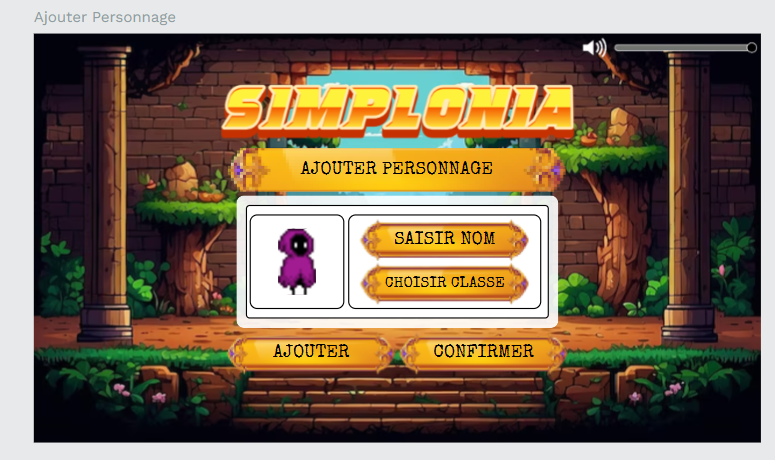
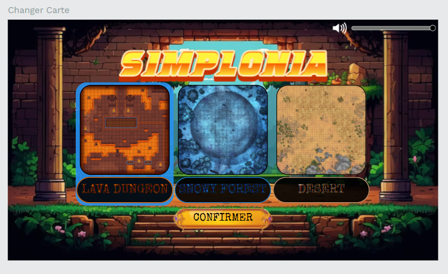

## Histoire du jeu

![titre] (./app/src/img/SimploniaLogo.png)

Dans un futur lointain, Simplon est devenue l'organisation mondiale de formation la plus prestigieuse, exigeant une maîtrise exceptionnelle des arts de la bataille et du savoir, enseignée par les légendaires Senior de l'institution. Au nombre de douze, ces mentors, chacun détenteur de talents uniques, sont reconnus pour leurs compétences extraordinaires :

- **Greg** et son serpent mythique, **Snake**.
- **Perrine**, accompagnée de ses fidèles animaux.
- **Yohann**, le sorcier **JavaScribe**.
- **Philippe**, maître de la **BDD** (le Berger de la Donnée).
- **Sacha**, aussi inébranlable qu'un rocher.
- **Florent** et son armée de guerriers **Warhammer**.
- **Aledorian**, maître de **PHP** (Philosophe Historien Professionnel).
- **Marine**, nécromancienne des conteneurs fantômes.
- **Maryline**, dessinatrice de mondes et créatrice d'univers.
- **Julie**, grande prêtresse du **CSS** (Créatrice Super Solide).
- **Maxence**, hackeur du futur.
- **Térence**, maître de l'**IA** (Imbattable Ambassadeur).

Ces maîtres, chacun à leur manière, incarnent les valeurs et les compétences que Simplon cherche à transmettre aux générations futures.

Maintenant, les générations futurs se battent pour pouvoir un jour être assis de ces grandes figues de Simplonia.

## Maquette

- [Maquette](https://design.penpot.app/#/workspace/a7b1ba17-1eb3-81d8-8005-45b516d12252/a7b1ba17-1eb3-81d8-8005-44aa02b5da6c?page-id=a7b1ba17-1eb3-81d8-8005-44aa02b5da6d)

Quelque images d'illustration : 

## Backlogs

- [Backlogs](https://github.com/orgs/2024-dwwm-bsm-p4/projects/28)

## Détail des fichiers et répertoires

### 1. `src/` : Code source principal

- **`index.js`** :
  - Point d'entrée du projet.
  - Initialise la scène, la caméra, le rendu, et démarre la boucle d'animation.
  - Charge les scènes ou objets principaux.

- **`scenes/`** :
  - Contient les scènes principales (`MainScene.js`, `OtherScene.js`).
  - Gère l'ajout de lumières, grilles, ou objets globaux spécifiques à la scène.

- **`objects/`** :
  - Définit des classes pour les objets interactifs (héros, ennemis, objets personnalisés).
  - Chaque fichier contient une logique spécifique à un objet.

- **`utils/`** :
  - Contient les gestionnaires globaux pour des tâches transversales :
    - Gestion de la caméra (`CameraManager.js`).
    - Chargement des modèles ou textures (`Loader.js`).
    - Gestion des lumières (`LightManager.js`).

- **`animations/`** :
  - Gestion des animations (mouvements, transitions, etc.).
  - `AnimationManager.js` peut centraliser les animations complexes pour les personnages ou objets.

---

### 2. `public/` : Fichiers accessibles par le navigateur

- **`index.html`** :
  - Structure HTML de base.
  - Charge les fichiers JavaScript et CSS nécessaires.

- **`styles/style.css`** :
  - Définit le style de l'interface utilisateur, par exemple pour les barres de santé ou le HUD.

- **`models/`** :
  - Contient les modèles 3D utilisés dans le projet (héros, ennemis, environnement).

- **`textures/`** :
  - Stocke les textures pour les objets, le sol, ou le ciel.

